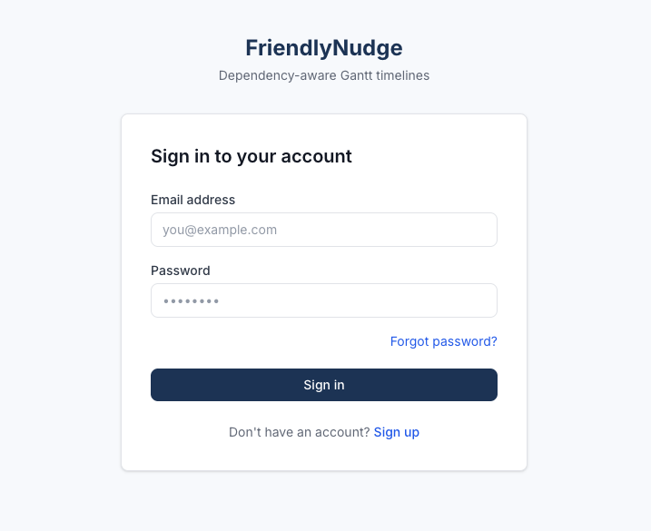
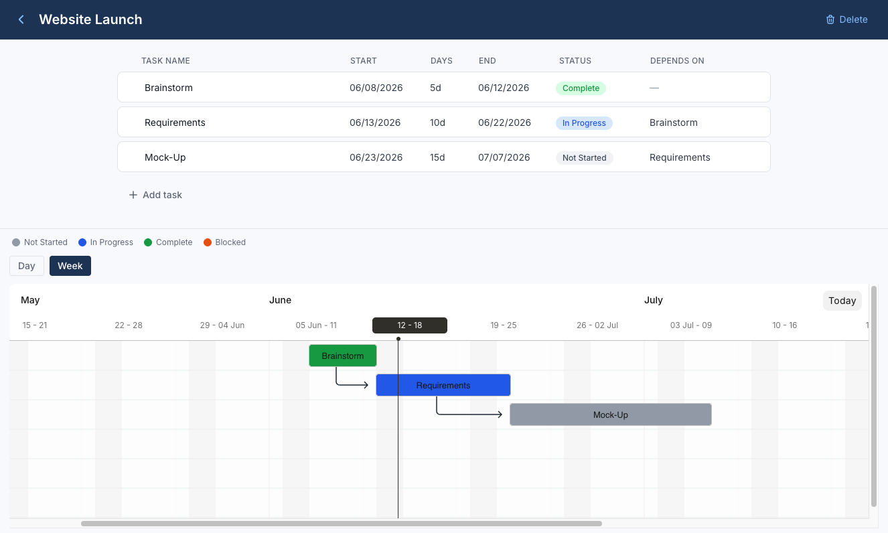

# FriendlyNudge

A dependency-aware project timeline tool built for project managers who are tired of manually chasing task owners for updates.

**[Live Demo →](https://friendlynudge.vercel.app/)**



---

## Overview

Many PM tools handle to-do lists fine but fall apart the moment tasks depend on each other. FriendlyNudge is built around the idea that timelines are relationships, not just dates: when one task slips, everything downstream should update automatically.

This is a solo-built, full-stack project — one person handling product decisions, architecture, and implementation end to end.

## Key Features

- **Finish-to-Start dependency engine** — mark Task B as dependent on Task A; when A's dates change, B (and everything downstream of B) recalculates automatically
- **Circular dependency detection** — the system rejects invalid dependency loops before they're saved, with a clear error naming exactly which tasks are involved
- **Interactive Gantt chart** — status-coded bars, dependency arrows, a live "today" marker, and Day/Week view toggling
- **Inline, spreadsheet-style editing** — no modals for basic task edits; click a field, edit it, done
- **Full authentication flow** — sign up, login, password reset, and account deletion via Supabase Auth
- **Real-time persistence** — every change syncs to PostgreSQL immediately, with optimistic UI updates so the interface never waits on the network

## Tech Stack


| Layer           | Technology                                 |
| --------------- | ------------------------------------------ |
| Framework       | Next.js (App Router) + TypeScript          |
| Styling         | Tailwind CSS                               |
| Server state    | TanStack Query                             |
| Database & Auth | Supabase (PostgreSQL + Row Level Security) |
| Gantt rendering | Frappe Gantt                               |
| Hosting         | Vercel                                     |


## Screenshots


| Dashboard | Timeline view (Gantt + task list) |
| --------- | --------------------------------- |
|  |  |


## Getting Started

Clone and run it locally:

```bash
git clone https://github.com/mraecomes/friendlynudge.git
cd friendlynudge
pnpm install
```

Create a `.env.local` file in the project root with:

```
NEXT_PUBLIC_SUPABASE_URL=
NEXT_PUBLIC_SUPABASE_ANON_KEY=
SUPABASE_SERVICE_ROLE_KEY=
```

You'll need your own Supabase project — create one free at [supabase.com](https://supabase.com) and copy the keys from Project Settings → API.

Then run:

```bash
pnpm dev
```

The app will be running at `http://localhost:3000`.

**Requirements:** Node.js 18.18 or later, pnpm.

## Project Structure

```
app/                  # Pages and API routes (Next.js App Router)
components/           # Reusable UI components (Gantt, tasks, generic UI)
lib/
  ├── supabase/       # Supabase client setup
  └── dependencies/   # Dependency graph logic (cycle detection, cascading recalculation)
types/                # Shared TypeScript types
```

## Status

MVP is complete and deployed. Currently in active development — expanding toward multi-project dashboards and automated notifications.

## License

All rights reserved. This code is publicly viewable for personal development purposes but is not licensed for reuse, modification, or redistribution.

## Author

**Mallory Comes**
[LinkedIn](https://www.linkedin.com/in/malloryraecomes/) · [GitHub](https://github.com/mraecomes)